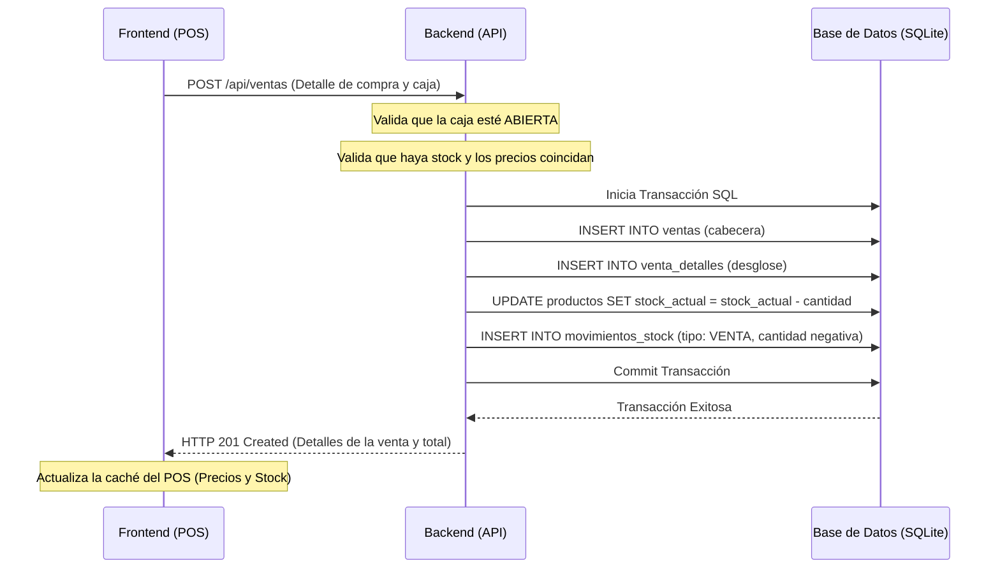

# Especificación Funcional — Kiosco Billing & Cash POS

Este documento detalla la especificación funcional completa y sin ambigüedades de la aplicación **Kiosco Billing & Cash POS**. Está diseñado para servir como referencia única tanto para la implementación técnica por parte del equipo de desarrollo, como para el diseño de casos de prueba del equipo de control de calidad (QA).

---

## 1. Introducción y Alcance

### 1.1 Resumen del Sistema
**Kiosco Billing & Cash POS** es una aplicación de Punto de Venta (POS) local y facturación simplificada diseñada para comercios minoristas y kioscos argentinos. Su objetivo central es agilizar el proceso operativo de ventas en el mostrador mediante escaneo de códigos de barra, optimizar el control de inventario en tiempo real sin permitir stock negativo, y asegurar la trazabilidad del flujo de dinero en efectivo e ingresos digitales mediante turnos de caja auditados.

### 1.2 Límites del Sistema (Fuera de Alcance)
Para mantener la simplicidad técnica y el enfoque MVP (Minimum Viable Product), quedan explícitamente excluidas las siguientes funcionalidades:
- **Conectividad AFIP / ARCA**: No se realiza emisión de factura fiscal electrónica ni comunicación con entes tributarios oficiales.
- **Multisucursal y Multitenancy**: La aplicación está pensada para ejecutarse de forma aislada (Single-Tenant) en un único servidor local o VPS por negocio.
- **Sincronización Multicaja**: No hay comunicación entre múltiples terminales de cobro concurrentes; se asume una única terminal de cobro activa por base de datos.
- **Métodos de Pago Mixtos**: Cada venta debe pagarse bajo un único método de pago exclusivo (`EFECTIVO` o `DIGITAL`).
- **Ventas Pendientes / Cuentas Corrientes**: El POS no admite suspender ventas en espera o fiar ("crédito de cliente / cuenta corriente / libreta").
- **Modificación Manual de Precios**: El cajero no puede cambiar el precio de venta unitario de un producto en caliente desde el carrito de compras; los precios deben ajustarse únicamente desde el panel de administración de Catálogo.
- **Devoluciones Parciales**: Si un cliente devuelve mercadería de una compra, la venta debe devolverse en su totalidad para revertir el stock de forma íntegra.

---

## 2. Matriz de Roles y Permisos (RBAC)

El sistema opera bajo un control de acceso basado en roles (RBAC) con tres niveles de privilegio claramente definidos. A continuación, se presenta la matriz de permisos para todas las operaciones operativas y administrativas:

| Operación / Recurso | Endpoint / Vista | Cajero | Supervisor | Administrador |
| :--- | :--- | :---: | :---: | :---: |
| **Autenticación (Login / Perfil)** | `POST /api/auth/login` `GET /api/users/me` | Sí | Sí | Sí |
| **Apertura de Caja** | `POST /api/cajas/apertura` | Sí | Sí | Sí |
| **Cierre de Caja Ciego** | `POST /api/cajas/cierre` | No | Sí | Sí |
| **Reapertura de Caja Cerrada** | `POST /api/cajas/{id}/reabrir` | No | No | Sí |
| **Registrar Ingreso/Retiro de Efectivo** | `POST /api/movimientos-caja` | No | Sí | Sí |
| **Registrar Ventas (Cobro POS)** | `POST /api/ventas` | Sí | Sí | Sí |
| **Anular Venta (Mismo día)** | `POST /api/ventas/{id}/anular` | No | Sí | Sí |
| **Devolver Venta (Cualquier día)** | `POST /api/ventas/{id}/devolver` | No | Sí | Sí |
| **Registrar Ajustes de Stock** | `POST /api/stock/ajuste` | No | Sí | Sí |
| **Ingreso de Mercadería (Proveedores)** | `POST /api/stock/ingreso` | No | Sí | Sí |
| **Gestionar Catálogo (CRUD)** | `/api/categorias` `/api/marcas` `/api/proveedores` `/api/productos` | No | Sí | Sí |
| **Configurar Accesos Rápidos (CRUD)**| `/api/accesos-rapidos` | No | Sí | Sí |
| **Visualizar Reportes y Exportar** | `/api/reportes/` | No | Sí | Sí |
| **Crear y Administrar Usuarios (CRUD)**| `/api/users` | No | No | Sí |

---

## 3. Especificación Detallada por Módulo

### 3.1 Módulo Ventas (POS)
- **Descripción Funcional**: Este módulo permite al operador de caja (Cajero, Supervisor o Administrador) registrar los productos del cliente a través del escaneo de códigos de barras, búsqueda textual predictiva o botones de acceso rápido táctiles, calculando el total neto tras aplicar descuentos y procesando el cobro definitivo.
- **Caso de Uso Principal**:
  1. El Cajero abre su caja si aún no está abierta. El sistema le redirige a la pantalla del POS.
  2. El Cajero pasa un producto por el escáner de códigos de barras o busca en la caja de texto predictiva.
  3. El sistema añade el producto al carrito con cantidad unitaria (`1`), o incrementa su cantidad si ya estaba en él, recalculando el subtotal y total neto.
  4. El Cajero presiona la tecla `F2` o el botón "Cobrar" para abrir el modal de pago.
  5. Selecciona el método de pago (`EFECTIVO` o `DIGITAL`).
     - Si es *Efectivo*, introduce el monto recibido. El sistema muestra el vuelto.
     - Si es *Digital*, el sistema inhabilita el vuelto e iguala el monto recibido al total de la venta.
  6. Presiona "Confirmar Pago". El backend descuenta el stock de forma transaccional, registra la venta y emite una señal de éxito.
- **Reglas de Negocio Estrictas**:
  - > [!IMPORTANT]
    > **Stock no negativo**: El frontend debe impedir la adición al carrito si la cantidad seleccionada supera el stock disponible del producto. La API de backend bloqueará cualquier venta transaccional que resulte en stock negativo devolviendo `INSUFFICIENT_STOCK`.
  - > [!WARNING]
    > **Descuento Máximo**: El total de descuentos aplicados no puede superar el porcentaje máximo de descuento configurado en la base de datos (por defecto `50%`). La API rechazará las ventas que lo excedan devolviendo `EXCEEDED_MAX_DISCOUNT`.
- **Entradas y Salidas**:
  - **Entradas**: ID de producto escaneado, método de pago, monto recibido.
  - **Salidas**: Vuelto en pesos decimales, ID de la venta creada, alerta sonora de éxito o error.

### 3.2 Módulo Catálogo (CRUD)
- **Descripción Funcional**: Proporciona el control administrativo total sobre las entidades del inventario: Productos, Categorías, Marcas, Proveedores y Accesos Rápidos, permitiendo altas, modificaciones y bajas.
- **Caso de Uso Principal**:
  1. El Administrador navega al menú "Catálogo".
  2. Selecciona la pestaña deseada (ej. "Productos").
  3. Hace clic en "+ Nuevo Producto", completando los datos: Nombre, Categoría, Precio de venta (pesos decimales), Stock inicial, Unidad de medida y códigos de barra asociados.
  4. Presiona "Guardar". El sistema procesa el registro y actualiza las listas de datos y selectores en caliente.
- **Reglas de Negocio Estrictas**:
  - > [!IMPORTANT]
    > **Manejo de Centavos**: Todos los precios de venta operados en pesos decimales por el usuario en los formularios (ej. `120.50`) se deben convertir a centavos enteros (multiplicando por `100`, ej. `12050`) antes de transmitirse a la API para evitar errores de redondeo de punto flotante en la base de datos.
  - > [!WARNING]
    > **Integridad Referencial (Foreign Keys)**: No se puede eliminar una Categoría, Marca o Proveedor que esté activamente referenciado por algún producto del catálogo. El backend arrojará un error 400 que el frontend capturará mostrando un Toast aclaratorio.
- **Entradas y Salidas**:
  - **Entradas**: Formularios de creación/edición, cajas de texto de búsqueda.
  - **Salidas**: Listados interactivos de tablas, Toasts informativos.

### 3.3 Módulo Caja (Turnos y Arqueo)
- **Descripción Funcional**: Regula el flujo de dinero de la caja registradora, requiriendo una apertura inicial para poder vender y un cierre de turno ciego para auditar los desvíos entre el monto físico contado y el esperado.
- **Caso de Uso Principal**:
  1. Al iniciar el turno, el Cajero ingresa el monto inicial de apertura.
  2. Al finalizar el turno, el Supervisor accede a la sección de cierre de caja, donde cuenta físicamente el dinero en efectivo del cajón y declara dicho total ("monto declarado").
  3. El sistema calcula internamente el "monto esperado" (fórmula: `inicial` + `ventas_efectivo` + `ingresos` - `retiros`) y la desviación (fórmula: `declarado` - `esperado`).
  4. La caja se archiva como CERRADA, bloqueando nuevas operaciones en la terminal.
- **Reglas de Negocio Estrictas**:
  - > [!IMPORTANT]
    > **Cierre Ciego**: El sistema no debe mostrar bajo ninguna circunstancia el monto esperado en efectivo al supervisor antes de que declare el dinero físico contado en el formulario, para evitar fraudes u omisiones sistemáticas de arqueo.
  - > [!WARNING]
    > **Caja Única**: El sistema valida a nivel base de datos que solo exista una caja activa en estado `ABIERTA` al mismo tiempo.
- **Entradas y Salidas**:
  - **Entradas**: Dinero físico inicial en apertura, retiro o ingreso de efectivo con motivo, dinero declarado en el cierre.
  - **Salidas**: Auditoría de desviación (diferencias de dinero) en el reporte de caja.

### 3.4 Módulo Inventario (Auditoría y Movimientos)
- **Descripción Funcional**: Permite registrar ingresos físicos de mercadería provenientes de distribuidores externos y hacer ajustes rápidos de stock por pérdidas, roturas o robos.
- **Caso de Uso Principal**:
  1. El Supervisor selecciona un producto del catálogo en la vista de inventario.
  2. Elige "Ingreso de Mercadería", completando la cantidad de unidades que entran y seleccionando de forma obligatoria el Proveedor.
  3. Presiona "Confirmar". El sistema incrementa el stock, añade un movimiento tipo `INGRESO` y audita el lote.
- **Reglas de Negocio Estrictas**:
  - > [!IMPORTANT]
    > **Trazabilidad Obligatoria**: Todo ingreso de mercadería requiere un proveedor obligatorio asignado. Todo ajuste manual de stock requiere un motivo textual obligatorio.
- **Entradas y Salidas**:
  - **Entradas**: ID del producto, cantidad física a ajustar, motivo o proveedor.
  - **Salidas**: Stock recalculado, histórico de movimientos de stock actualizado.

### 3.5 Módulo Reportes y Exportaciones
- **Descripción Funcional**: Proporciona consolidados financieros de las ventas del día, desvíos de turnos de cajas anteriores, rankings de productos más demandados y alertas de stock por debajo del mínimo para reposición.
- **Caso de Uso Principal**:
  1. El Supervisor ingresa al panel de "Reportes".
  2. Selecciona un reporte (ej. "Ranking de Productos") y aplica filtros de fecha.
  3. Visualiza la tabla ordenada y presiona "Exportar PDF". El backend genera y descarga el archivo optimizado para impresión.
- **Reglas de Negocio Estrictas**:
  - Los datos exportados no deben diferir en céntimos de los acumulados de las tablas de transacciones.
- **Entradas y Salidas**:
  - **Entradas**: Fechas de filtro, tipo de ordenamiento del ranking.
  - **Salidas**: Archivo binario descargable en formato CSV, Excel (`.xlsx`) o PDF.

---

## 4. Flujos e Integración de Datos

El sistema opera mediante flujos transaccionales altamente acoplados para garantizar la integridad física de la base de datos SQLite. Cuando se confirma una venta en el POS, ocurren los siguientes pasos de forma atómica:

### 4.1 Reversión de Datos (Anulación vs Devolución)
- **Anulación**: Modifica el estado de la venta a `ANULADA`, revierte la salida de stock incrementando la cantidad de unidades correspondientes a los productos vendidos en la tabla `productos`, y registra movimientos de stock tipo `ANULACION` con referencia al ID de la anulación.
- **Devolución**: Modifica el estado de la venta a `DEVUELTA`, realiza el mismo incremento de stock correspondiente y genera un registro contable de egreso en la caja registradora.

---

## 5. Requisitos de Interfaz y Usabilidad (UX/UI)

### 5.1 Diseño de Layout y Sidebar
La aplicación cuenta con una distribución responsiva dividida en dos zonas:
- **Barra Lateral Izquierda (Sidebar)**: Con un ancho fijo de `260px` (`60px` colapsado en pantallas inferiores a `900px`). Contiene los enlaces de navegación directa de los módulos y los datos del usuario logueado en la parte inferior.
- **Contenedor Principal (Derecha)**: Un visor dinámico (`.views-container`) de `100vw - sidebar` sin barra de scroll general del navegador. Las tablas y formularios dentro del visor manejan scrolls internos específicos para evitar el desborde vertical de la pantalla.

### 5.2 Atajos de Teclado del POS
Para maximizar la velocidad de operación en el mostrador, se configuran los siguientes atajos globales:
- **`F2`**: Abre instantáneamente el modal de cobro y pago de la venta en curso (si el carrito tiene ítems).
- **`F9`**: Limpia completamente el carrito de compras actual tras mostrar una advertencia interactiva de confirmación.
- **`Enter`**: En el campo de búsqueda de productos, añade el producto directamente al carrito si hay stock.

### 5.3 Gestión del Escáner de Códigos de Barra
El lector de código de barras físico se integra simulando una ráfaga de entrada de teclado muy veloz. El frontend monitoriza los eventos `keydown` globales y, si detecta una ráfaga completa de caracteres numéricos ingresados en un intervalo menor a `30 milisegundos`, descarta el envío ordinario, interpreta los dígitos como un código de barra (EAN-13), busca el producto correspondiente y lo añade al carrito.

### 5.4 Respuestas Sonoras del Sistema (Web Audio API)
Para no depender de conexiones de red ni archivos estáticos pesados, el sistema cuenta con un sintetizador de audio offline mediante la Web Audio API que emite señales sonoras de respuesta:
- **Sonido de Éxito (Beep Agudo)**: Se dispara al añadir con éxito un producto mediante escáner o confirmar un cobro.
- **Sonido de Error (Zumbido Grave)**: Se dispara al escanear un código inexistente, registrar faltante de stock o al rebotar una validación de guardado de datos.
