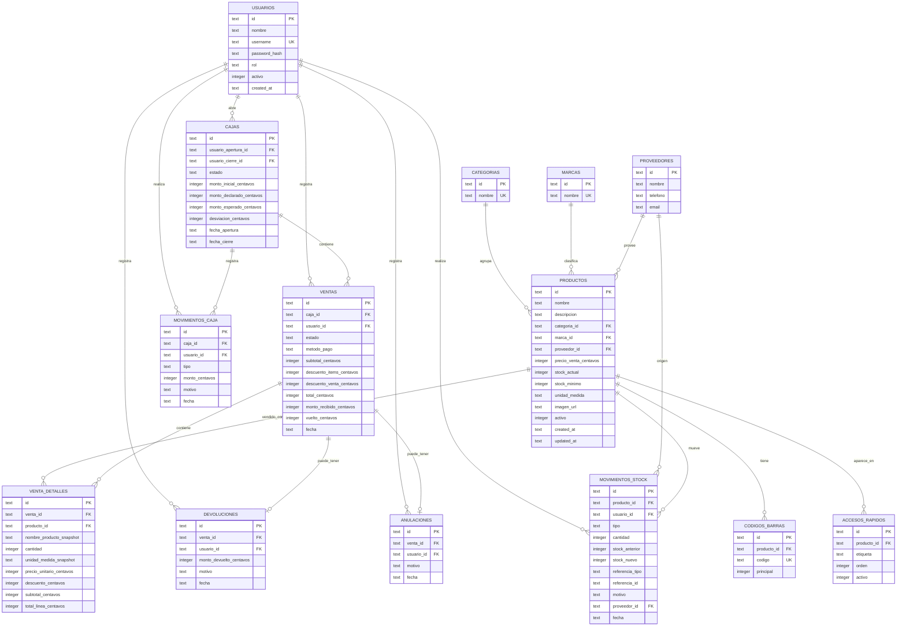

# erd.md

# ERD - Entity Relationship Diagram

## Cardinalidades principales

- Un usuario puede abrir muchas cajas.
- Una caja puede contener muchas ventas.
- Una venta pertenece a una caja.
- Una venta tiene uno o más detalles.
- Un producto puede tener muchos códigos de barras.
- Un producto puede participar en muchos detalles de venta.
- Una venta puede tener como máximo una anulación.
- Una venta puede tener como máximo una devolución.
- Todo movimiento de stock pertenece a un producto.
